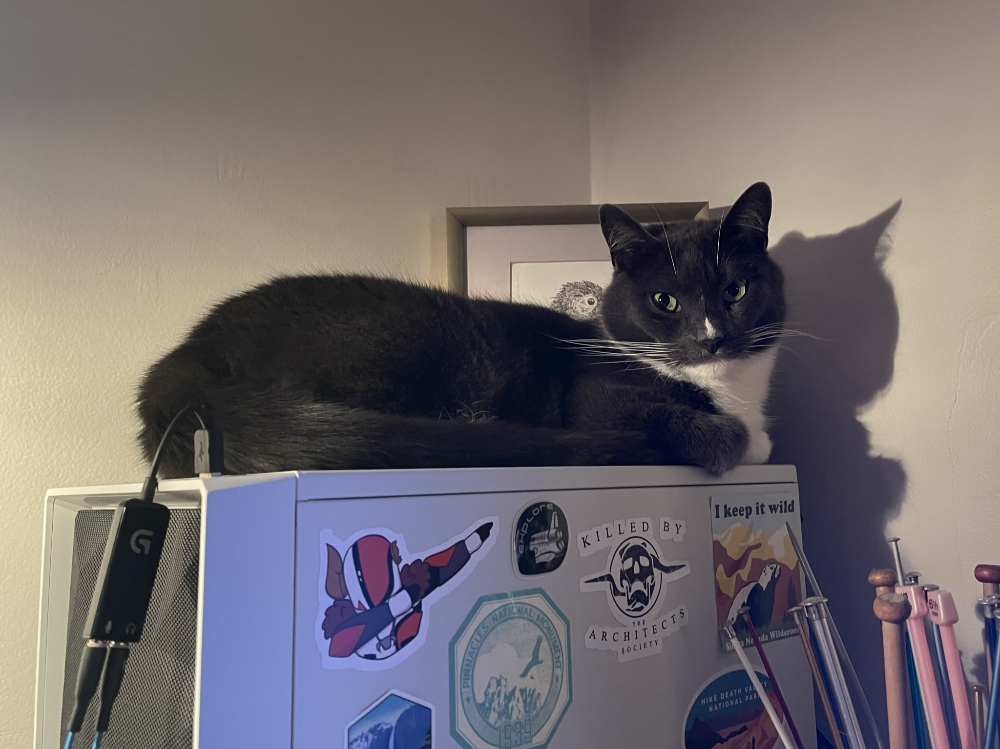

---
## Configure header of page
text_align_right: false
show_title_as_headline: false
headline: |
  Hi, I'm Josie Lesage.
---

<!-- this is a subheadline -->

I'm scientist, educator, and huge nerd. I love getting excited about nature and data, and helping other people get excited about those things too. 

  I have a Ph.D in Environmental Studies from the University of California, Santa Cruz in 2020, and a B.S. of Aquatic Biology from the University of California, Santa Barbara. I'm an ecologist by training, but have dabbled in botany, pedagogy, and data science.
  
  I'm a huge [iNaturalist nerd](https://www.inaturalist.org/observations?place_id=any&user_id=castillejajosie&verifiable=any), and love getting involved in community science efforts. 
  
  I'm currently living in Santa Barbara with my partner and cat (Walter) and ball python (Steve), but we're moving up to Portland, Oregon soon. 
  
  

