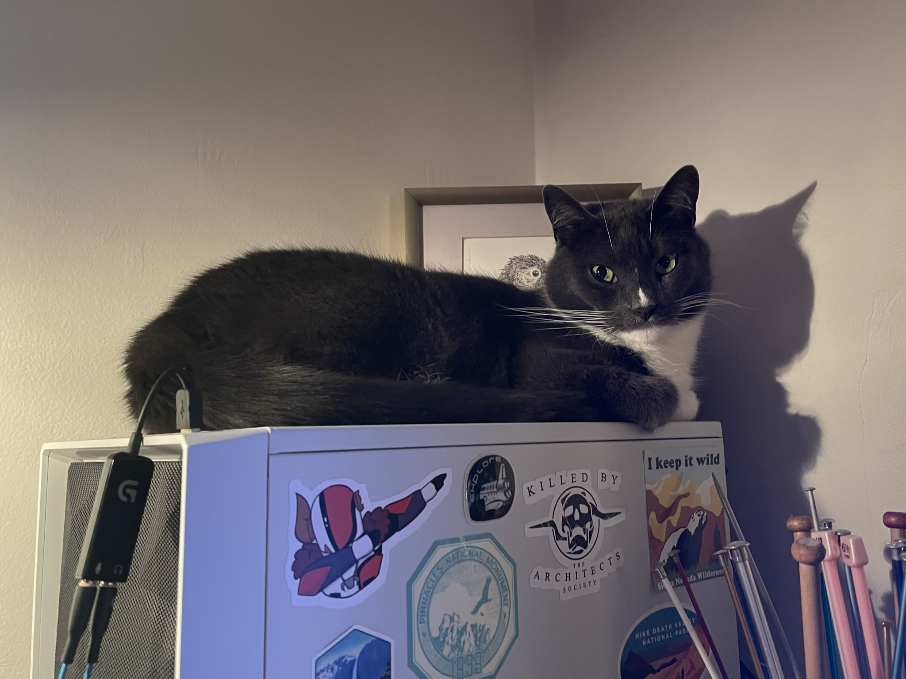

---
## Configure page content in wide column
title: # leave blank to exclude
number_featured: 0 # pulling from mainSections in config.toml
use_featured: true # if false, use most recent by date
number_categories: 0 # set to zero to exclude
show_intro: true
intro: |
  I’m a scientist, educator, and huge nerd. I love getting excited about nature and data, and helping other people get excited about those things too. 
  
  I have a Ph.D in Environmental Studies from the University of California, Santa Cruz (graduated 2020), and a B.S. of Aquatic Biology from the University of California, Santa Barbara (2013). I’m an ecologist by training, but have dabbled in botany, pedagogy, and data science.
  
  
  
  I’m pretty active on [iNaturalist](https://www.inaturalist.org/observations?place_id=any&user_id=castillejajosie&verifiable=any), and love getting involved in community science efforts.
  
  
  
  I’m currently living in Portland, Oregon with my partner, cat (Walter), and ball python (Steve), and teaching Environmental Studies at Clark College in Vancouver, WA.
  
  
  
  Want to look through my CV? [Click here!](https://docs.google.com/document/d/1IVgTIOtMJ4LZAIPqM4Pr6L2Ps6Yh9HUO0hZ1q5XHVkg/edit?usp=sharing)
---
** index doesn't contain a body, just front matter above.
See about/list.html in the layouts folder **