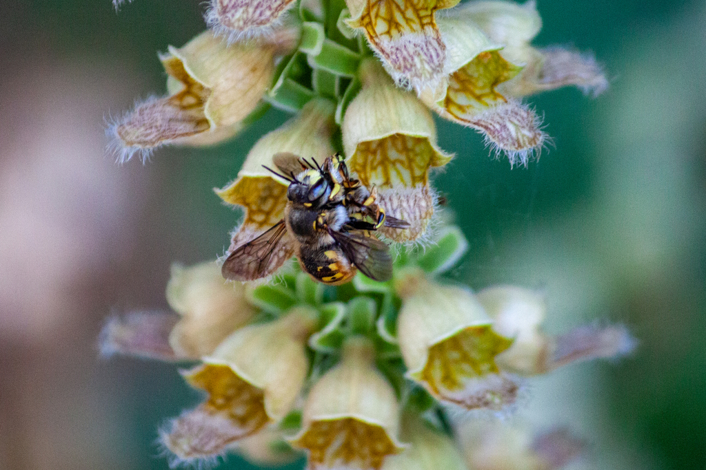
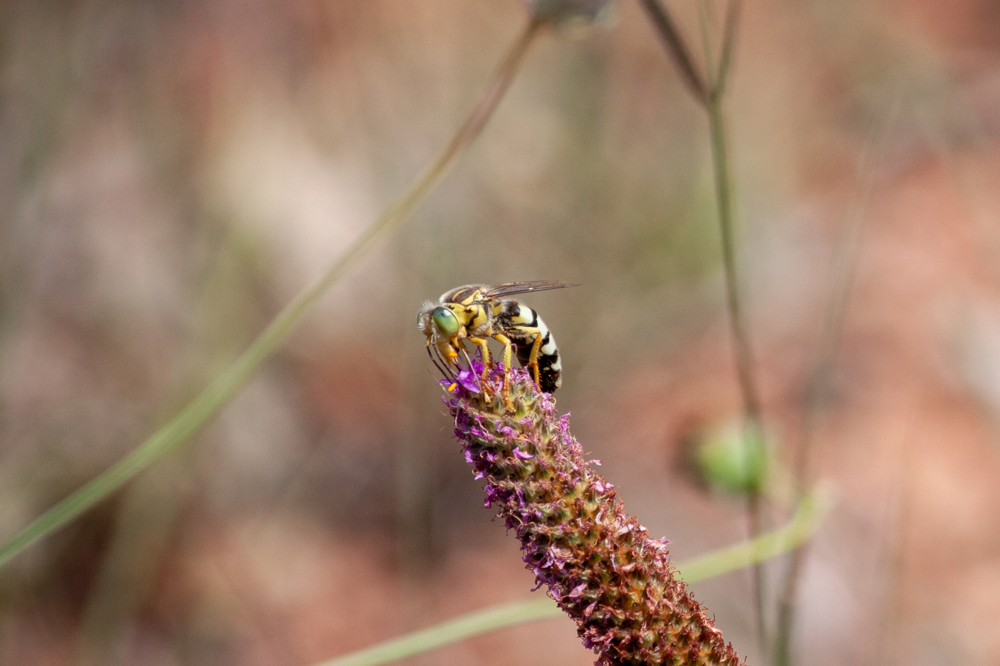
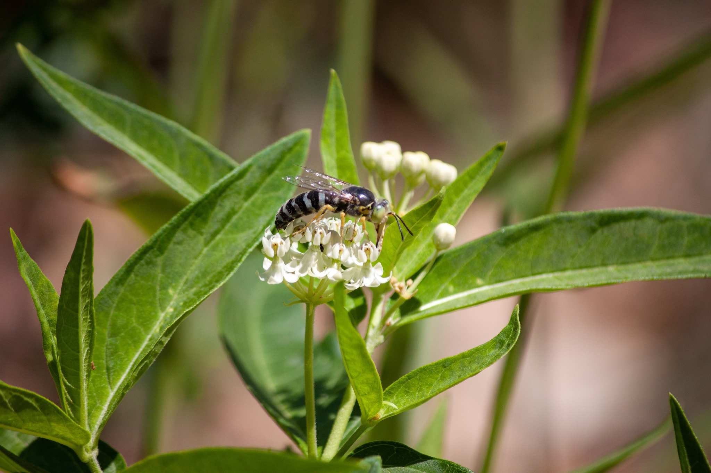
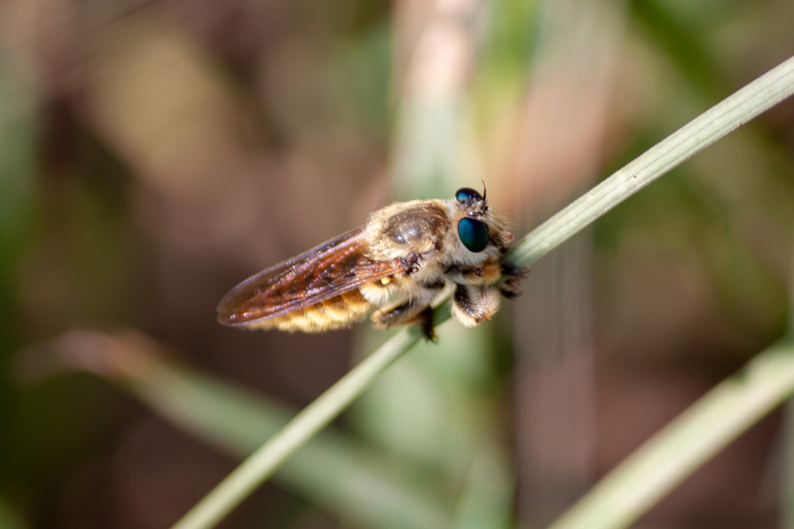

In summer 2021's brief lull in the COVID-19 pandemic, I went on a vacation to Colorado. I saw many cool insects, plants, and rocks - the landscape out there is lovely. These are some highlights from that trip.

### Denver
As a plant nerd, I have to recommend the Denver Botanic Garden. It's a gorgeous botanic garden with many charming sub-sections. And where there are well-loved and blooming flowers, you'll also find insects! Three of my favorite shots from our visit to the botanic garden are the long-horned bee (tribe *Eucerini*) nectaring on a sunflower, two wool-carder bees (*Anthidium*) mating, and an Aphrodite fritillary (*Speyeria aphrodite*) with scales sparkling in the sun:

### Garden of the Gods
One of our first stops was at the Garden of the Gods, a natural park area near Colorado Springs. The park is home to some spectacular rock formations, and though we didn't see any on our visit, there can be bighorn sheep climbing around on those cliffs.

Of course, whenever I wasn't looking up at the gorgeous rocks, I was searching for flowers and insects - which there were plenty of. For example, check out these two cool sand wasps (tribe *Bembicini*)!

### Boulder and Chataqua Park
We also spent a few days in Boulder, soaking up good weather and exploring locally. If you're ever in the area during the summer, I'd highly recommend hanging out near Boulder Creek - and bring your siwm gear and an inner tube! And after you've had enough fun in the water, you can dry off on a hike up to the Flatirons at Chataqua park. 

There are numerous trail routes through the park, and for the intrepid, you can even climb some of them. We took a relatively gentle loop around the park one morning, and then returned the next evening to enjoy the change in light on the rocks.

While out there, I saw some fantastic robber flies (*Asilidae*), which are highly modified predatory flies. They're some of my favorite organisms to get photos of, because they tend to stay put no matter how in their face I get with my camera -- great for macro photography!

This was also the first time I'd encountered a bee-mimic robber fly - look at how fuzzy this lil guy was!

### El Dorado Canyon State Park
If you're still looking for some hiking, I'd also recommend visiting El Dorado State Park near Boulder. There are more spectacular views, and it's a relatively short drive from town. 

We traversed the Fowler trail, which is about a half mile long and is a relatively mild grade and well maintained - plus, it's perched along a cliff, so you have spectacular views the whole way.

We ended up taking the "long way" home, which is to say that we drove out to the Gross Reservoir and took Flagstaff road home -- and were rewarded with a vista of this lovely big tree at the Cresent Meadows Trailhead. 

Overall, it was a lovely trip to Colorado and I hope to visit again in the future someday.

### See more

Check out more of my iNaturalist observations from this area [here](https://www.inaturalist.org/observations?place_id=34&subview=map&user_id=castillejajosie&verifiable=any)!
