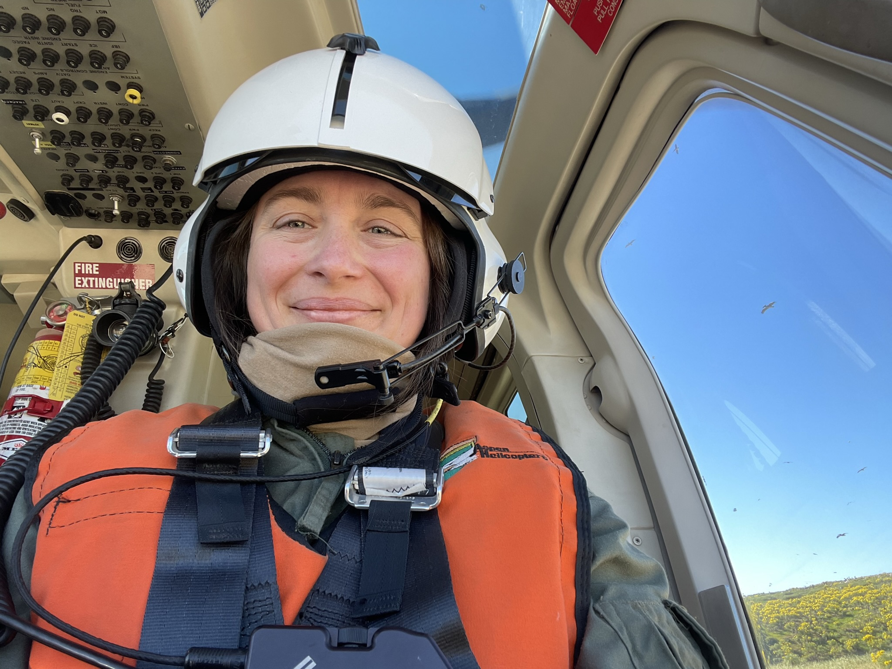
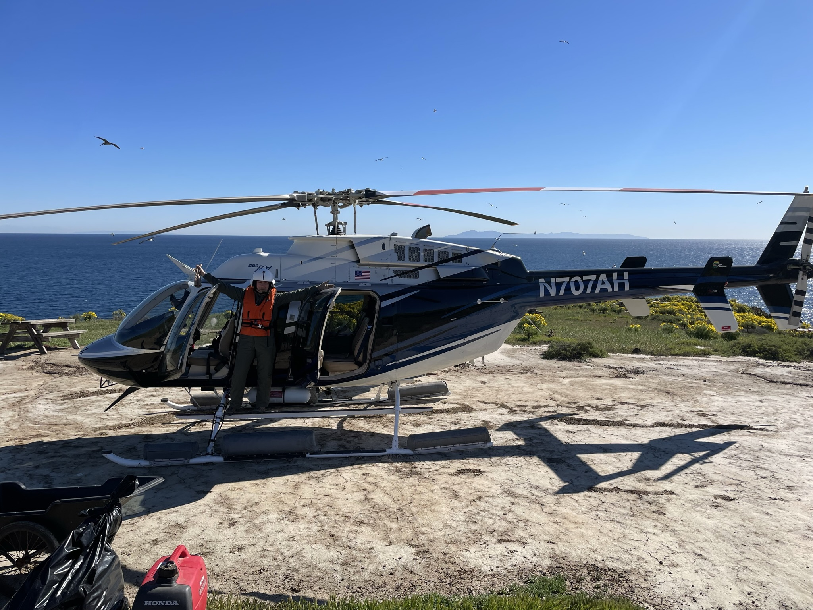
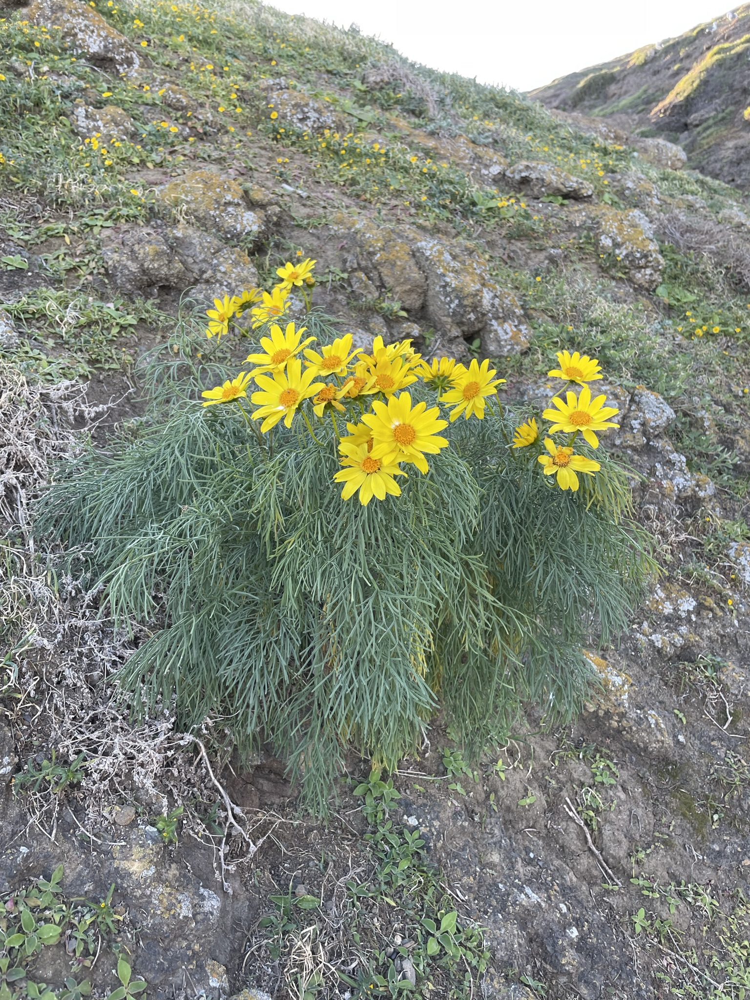
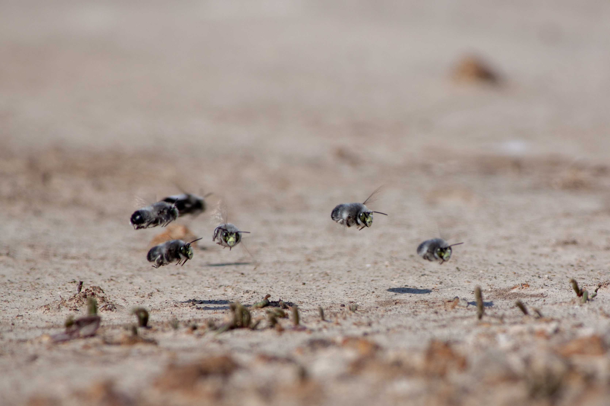

## Santa Barbara Island
In 2022, I was lucky enough to get the opportunity to help the National Park Service (NPS) with their annual vegetation monitoring on Santa Barbara Island. This island is the smallest of the channel islands, and lacking the cute island foxes known from the other NPS islands -- but it's still a real treat to get to visit it.

To get there, we took a helicopter. This was the first time I'd ever taken a helicopter, and for a short while, I was pretty sure I had made a career mistake and should have been a pilot instead... but then I realized there are no plants in helicopters. Still beaming ear to ear after getting to see whales on the ride over, though!

The island itself is tiny, so you can walk a perimeter of the whole thing in about an afternoon. I was there in late February, which meant the giant coreopsis (*Leptosyne gigantea*) were in full bloom. Impressive patches of these plants turn entire slopes yellow in the spring!

To drive home the point that these plants are super cool and absolutely stunning for the short time they're in full bloom, here's a Say's phoebe (*Sayornis saya*), backlit through some coreopsis, and a sunset over a whole slope of them. 

Of course, there's also plenty of opportunity for gorgeous sea-cliff photos on Santa Barbara Island. During our lunches, we'd usually try to find a spot near a great ocean view (a pretty easy task out there) and I'd snap a photo or two if I had the chance. Off of the southeast end of the island is a tiny islet called "Sutil Island".

I can't wrap up this journey without some photos of the great animals and plants I saw out there. First up is this great comparison shot, showing off the tremendous size difference between elephant seals (*Mirounga angustirostris*) and california sea lions (*Zalophus californianus*) hauled out on the beach:

The island is also home to many breeding brown pelicans (*Pelecanus occidentalis*). I'd never seen a pelican nest before this trip, but they build very large pedestals with broken branches from the plant life nearby.

And finally, a smattering of some more great organisms I was lucky enough to capture while out: a peregrine falcon making use of a bench, a spider enjoying a snack, and some digger bees zipping around close to the soil surface.

Santa Barbara Island is a fantastic place, and I recommend the visit if you ever get the opportunity. 

### See more

Check out more of my iNaturalist observations from this area [here](https://www.inaturalist.org/observations?place_id=53631&subview=map&user_id=castillejajosie&verifiable=any)!
