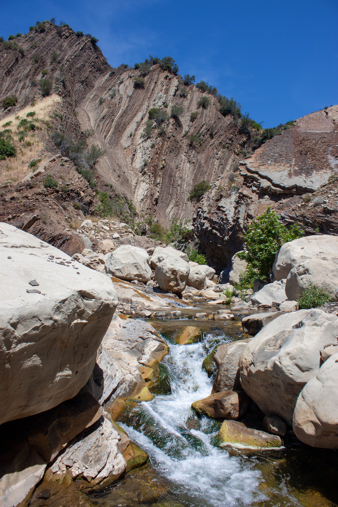
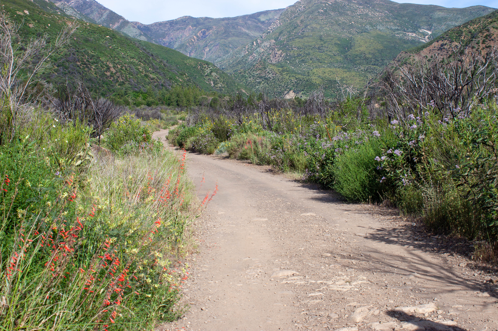
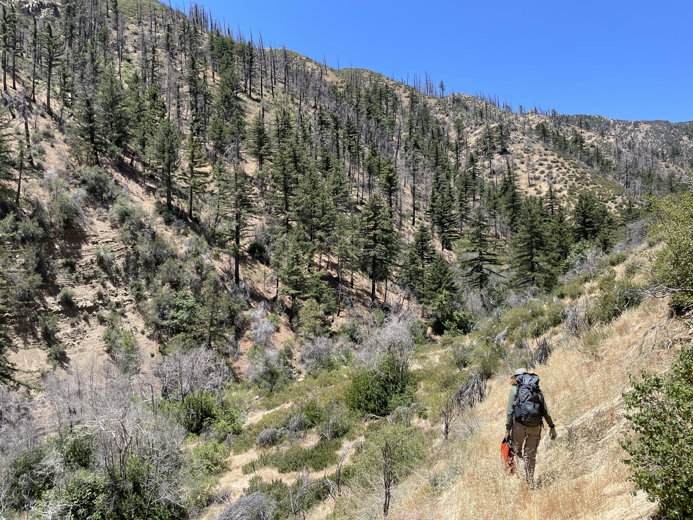
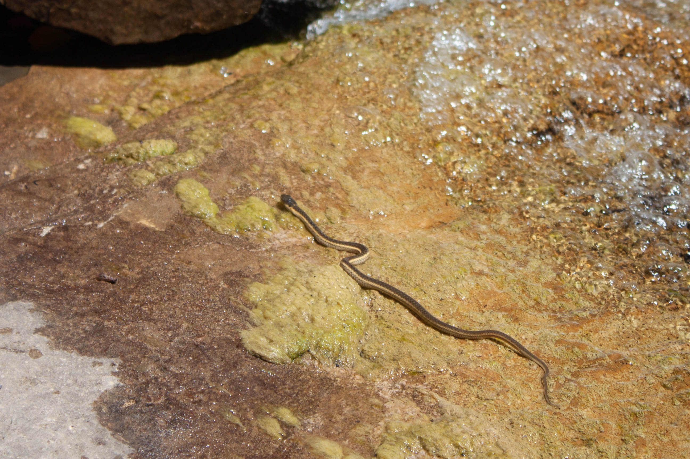
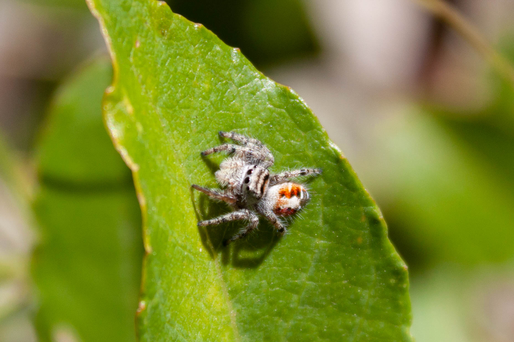
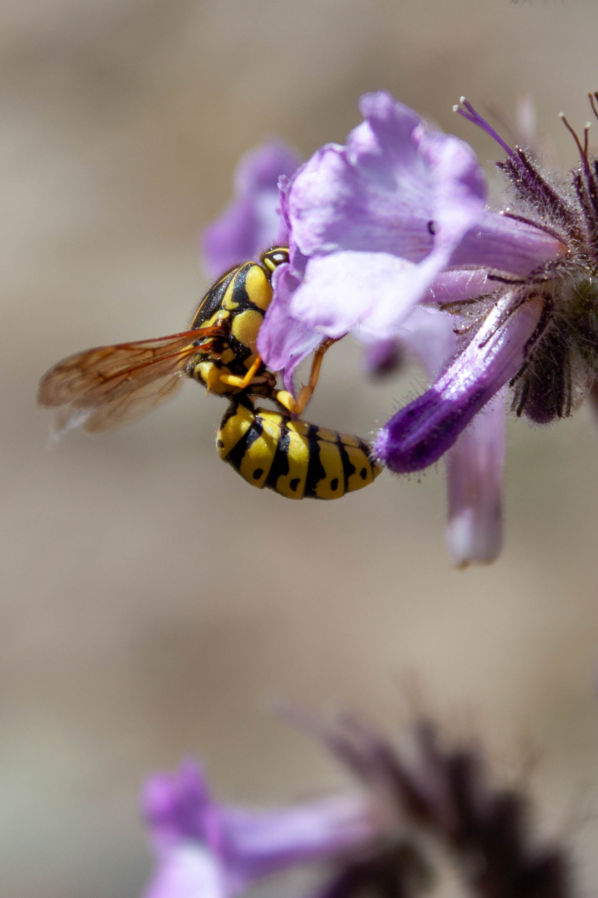

---
categories:
- Los Padres
date: "2021-05-01"
draft: false
author: Josie Lesage
title: Matilija Wilderness
excerpt: ""
layout: single
subtitle: Photos from a few hikes in the Matilija Wilderness, in June 2020 and 2021.
tags:
- Los Padres
- Matilija Wilderness

---

## The Matilija Wilderness

As a part of my survey work in the Thomas Fire Scar for the [Santa Barbara Botanic Garden](https://sbbotanicgarden.org/conservation/our-impact/restoring-habitats/), I visited the Matilija Wilderness in 2020 and 2021. It's one of 10 wilderness areas in the Los Padres, and home to some gorgeous streams, cool plant communities, and peaceful backcountry camps. 

### The Landscape
The Matilija Wilderness is home to some of the headwater forks of Matilija Creek, a persistent stream that runs through the rugged landscape -- making it a great place to backpack or visit waterfalls. In 2020, I hiked the Matilija Canyon Trail to Matilija Falls, and in 2021, I hiked the North Fork Matilija Trail.

On your way in, you'll pass by several private inholding properties, where the early summer roadside is covered with lovely blooming native plants -- recovering quickly from the charred skeletons left by the Thomas Fire.

In 2021, I camped at Middle Matilija Camp, a lovely creek-side spot that we had to ourselves, and was shaded by some towering (if burned out) trees. 

If you continue hiking along the Matilija Camp trail, you'll eventually reach Maple Camp, just below where the trail connects to the Cherry Canyon Forest Service Road. Up here, you can see the fire damage to the large stands of bigcone Douglas fir (*Pseudotsuga macrocarpa*) that are found in the area. 

### The Plants
Matilija has a gorgeous native plant named after it - the Matilija poppy (*Romneya* species)! This genus is also known as the "fried egg" flower, for obvious reasons.

I also got to encounter the fabulous, person-sized candelabrum that is *Mentzelia laevicaulis*, or "giant blazing star". *Mentzelia* is a fun genus, but good luck if you accidentally bruch the leaves with your clothing - many Mentzelia species have incredible velcro-like hairs (called trichomes) that make peeling the material off almost impossible. 

And the last flower I want to share is *Delphinium*. There are a number of California-native *Delphinium*, but sheesh are they hard to ID! I'm choosing to admire these without a key from now on. 

### The Critters

And of course, where there are cool plants, you're sure to find cool critters! I didn't expect to see this cute little snake so close to water, but apparently it's a two-striped garter snake (*Thamnophis hammondii*), and they're often found very close to water. 

This jumping spider is too pretty not to share - I'm not sure what species it is, but I think it's in the genus *Phiddipus*. So beautiful!

And of course, a lovely wasp. I just think they're gorgeous - apparently, this one is a member of the pollen wasps group (*Pseudomasaris*), and is unusal amoung wasps because it feeds pollen and nectar to its young (as opposed to most wasps, who feed their young on other organisms!). 

### See more

Check out more of my iNaturalist observations from this area [here](https://www.inaturalist.org/observations?place_id=123585&subview=map&user_id=castillejajosie&verifiable=any)!
