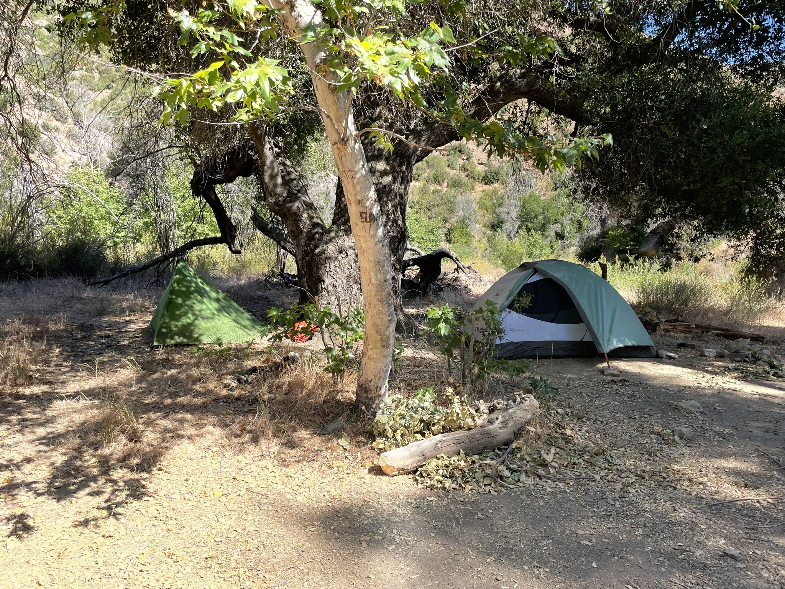

---
categories:
- Los Padres
date: "2021-05-01"
draft: false
author: Josie Lesage
title: Matilija Wilderness - June 2020 and 2021
excerpt: ""
layout: single
subtitle: A few hikes in the Matilija Wilderness, June 2020 and June 2021. 
tags:
- Los Padres
- Matilija Wilderness

---

## The Matilija Wilderness

As a part of my survey work in the Thomas Fire Scar for the [Santa Barbara Botanic Garden](https://sbbotanicgarden.org/conservation/our-impact/restoring-habitats/), I visited the Matilija Wilderness in 2020 and 2021. It's one of 10 wilderness areas in the Los Padres, and home to some gorgeous streams, cool plant communities, and peaceful backcountry camps. 

### The Landscape
The Matilija Wilderness is home to some of the headwater forks of Matilija Creek, a persistent stream that runs through the rugged landscape -- making it a great place to backpack or visit waterfalls. 

### The Plants

### The Bugs

### Learn more

Check out more of my iNaturalist observations from this area [here](https://www.inaturalist.org/observations?place_id=123585&subview=map&user_id=castillejajosie&verifiable=any)!
