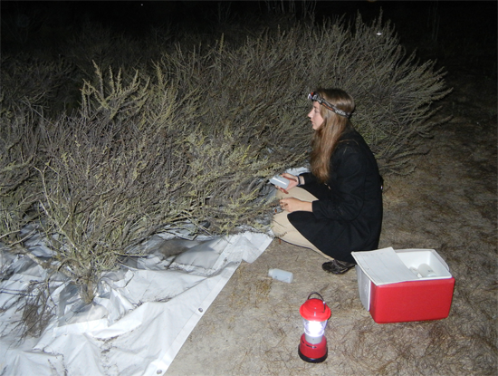
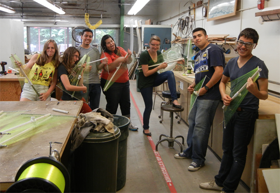

---
categories:
- Ecophysiology
date: "2015-07-01"
draft: false
author: Josie Lesage and Nathan Emery
title: Late summer fog use in California sagebrush
excerpt: "Coastal fog affects many California plant species and can be critically important to species that experience periodic drought. To determine fog water use in drought-deciduous plants, we manipulated access to fog drip and measured the water relations of the common shrub, *Artemisia californica*, near Santa Barbara, CA."
layout: single
subtitle: Drought-deciduous shrubs can benefit from foggy conditions in the late summer.
tags:
- Restoration
links:
- icon: "book-open"
  icon_pack: fas
  name: Read it online
  url: https://www.researchgate.net/profile/Nathan-Emery-5/publication/280987149_Late_Summer_Fog_Use_In_The_Drought_Deciduous_Shrub_Artemisia_californica_Asteraceae/links/56b3775d08ae1f8aa45346f1/Late-Summer-Fog-Use-In-The-Drought-Deciduous-Shrub-Artemisia-californica-Asteraceae.pdf
---

### Abstract

Coastal fog affects many California plant species and can be critically important to species that experience periodic drought. Drought-deciduous species in particular rely on water availability to maintain their leaves during the summer. To determine fog water use in drought-deciduous plants, this study manipulated access to fog drip and measured the water relations of the common shrub, *Artemisia californica*, near Santa Barbara, CA. Fog water availability increased plant water content but had no effect on pre-dawn xylem pressure potential. While climatic variability inhibits reliable fog input to *A. californica* in Santa Barbara, this species can use fog water opportunistically and benefits from large fog events during the summer drought.

### Photos from the project

<figure>
<figcaption>Collecting pre-dawn field samples to measure xylem pressure potential. Photo by Nate Emery.</figcaption>
</figure>

<figure>
<figcaption>As a part of my exploration of the effects of fog on native plant species, I constructed fog collectors with help from community college students in the Jack Kent Cooke Bridges mentorship program. Photo by Nate Emery.</figcaption>
</figure>

### Learn more

This paper is available online  [here](https://www.researchgate.net/profile/Nathan-Emery-5/publication/280987149_Late_Summer_Fog_Use_In_The_Drought_Deciduous_Shrub_Artemisia_californica_Asteraceae/links/56b3775d08ae1f8aa45346f1/Late-Summer-Fog-Use-In-The-Drought-Deciduous-Shrub-Artemisia-californica-Asteraceae.pdf)!
